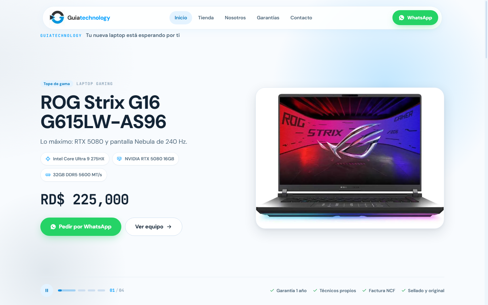
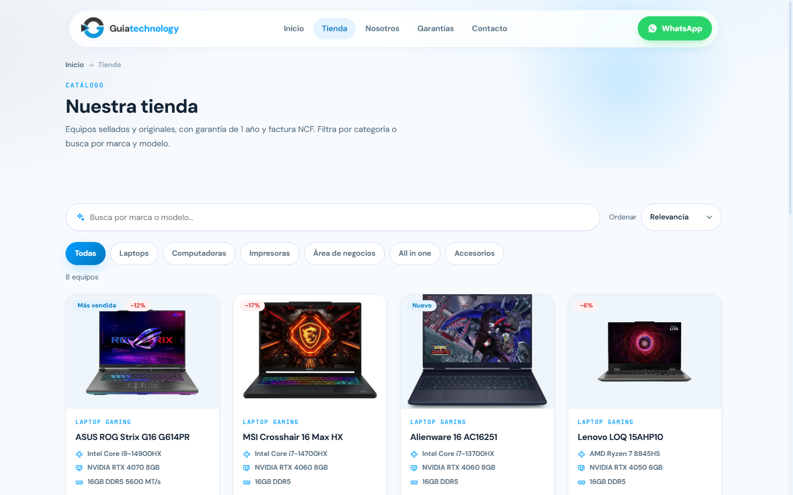
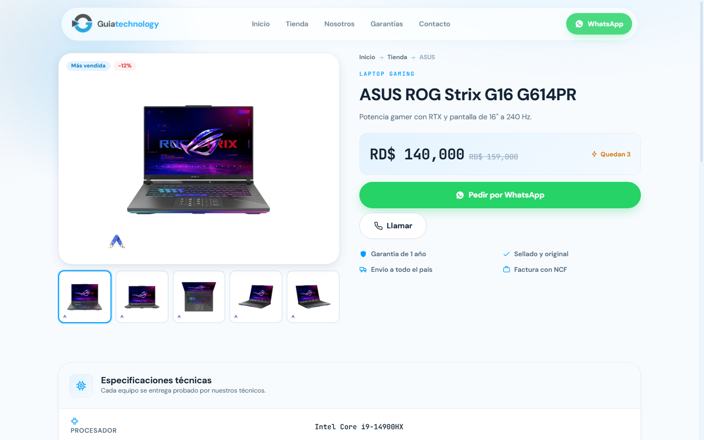
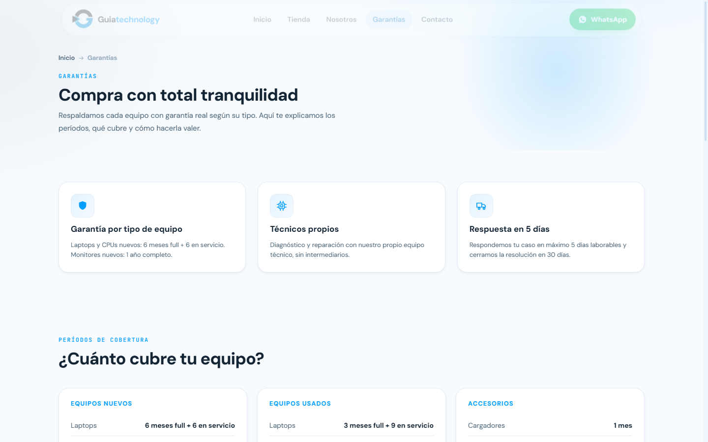
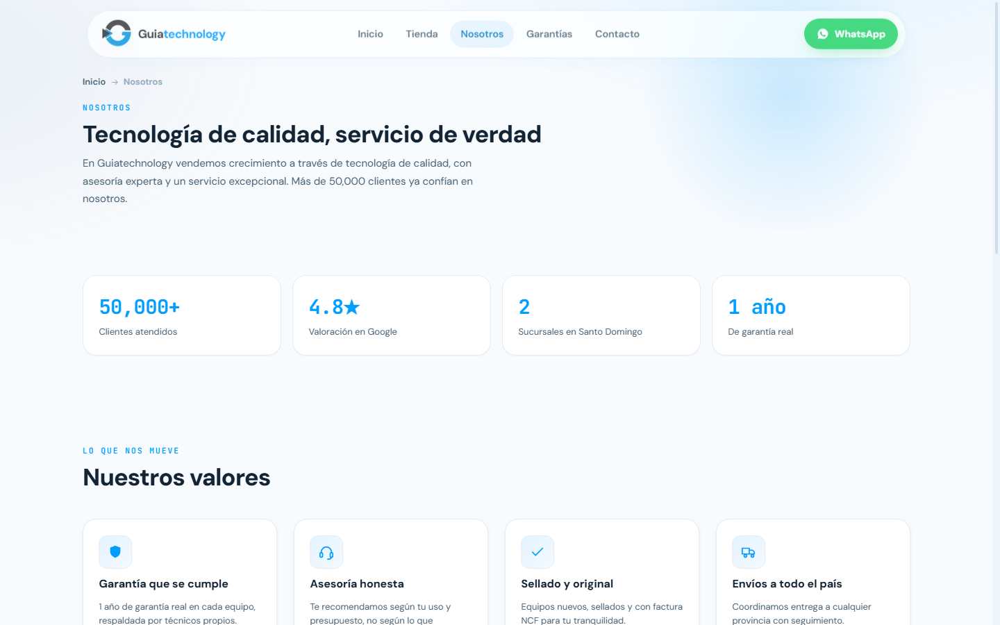
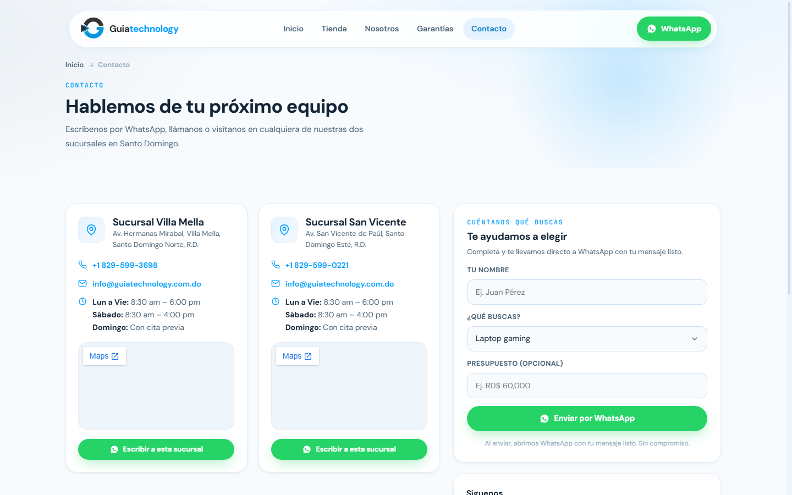

# Guiatechnology — Tienda Online

Sitio web de ecommerce para **Guiatechnology**, empresa dominicana de venta de laptops, computadoras y accesorios tecnológicos. Desarrollado con Next.js 15 y desplegable con Docker.

---

## Capturas de pantalla

| Inicio | Tienda |
|--------|--------|
|  |  |

| Página de producto | Garantías |
|--------------------|-----------|
|  |  |

| Nosotros | Contacto |
|----------|----------|
|  |  |

---

## Stack

- **Framework:** Next.js 15 (App Router) + React 19 + TypeScript
- **Estilos:** CSS Modules + design tokens globales (sin framework de UI)
- **Fuentes:** DM Sans + JetBrains Mono vía `next/font`
- **Imágenes:** `next/image` con optimización automática
- **Despliegue:** Docker (modo `standalone`)

---

## Páginas

| Ruta | Descripción |
|------|-------------|
| `/` | Hero con carrusel, categorías, productos destacados, marcas y testimonios |
| `/tienda` | Catálogo con filtros por categoría, marca y búsqueda en tiempo real |
| `/producto/[slug]` | Ficha de producto con galería, specs técnicas y CTA por WhatsApp |
| `/garantias` | Períodos de cobertura por tipo de equipo, condiciones y FAQs |
| `/nosotros` | Historia, valores y equipo de Guiatechnology |
| `/contacto` | Formulario de contacto + ubicaciones de sucursales |

---

## Productos incluidos

| Producto | Categoría | GPU |
|----------|-----------|-----|
| ASUS ROG Strix G16 G614PR | Laptop Gaming | RTX 4070 |
| ASUS ROG Strix G16 G615LW-AS96 | Laptop Gaming | RTX 5080 |
| MSI Crosshair 16 Max HX | Laptop Gaming | RTX 4060 |
| Alienware 16 AC16251 | Laptop Gaming | RTX 4060 |
| Lenovo LOQ 15AHP10 | Laptop Gaming | RTX 4050 |
| HP Victus 15 | Laptop Gaming | RTX 3050 |
| Acer Aspire 3 | Laptop Estudiantes | Intel UHD |
| Dell OptiPlex Mini PC | Mini PC | Intel UHD 770 |

---

## Correr con Docker

```bash
# Construir y levantar (puerto 3001)
docker compose up --build -d

# Sitio disponible en:
# http://localhost:3001

# Desde otros dispositivos en la misma red:
# http://<IP-local>:3001

# Ver logs
docker compose logs -f

# Detener
docker compose down
```

---

## Correr en desarrollo local

```bash
npm install
npm run dev     # http://localhost:3000
npm run build   # build de producción
npm start       # servir el build
```

---

## Estructura del proyecto

```
├── app/
│   ├── layout.tsx              # Nav + Footer globales, fuentes, metadata
│   ├── globals.css             # Design system: tokens, glass, botones, utilidades
│   ├── page.tsx                # Inicio
│   ├── tienda/                 # Catálogo
│   ├── producto/[slug]/        # Ficha de producto (SSG)
│   ├── garantias/              # Política de garantía
│   ├── nosotros/               # Sobre la empresa
│   └── contacto/               # Contacto
├── components/                 # NavIsland, Footer, ProductCard, Icon, HeroCarousel…
├── data/
│   ├── products.ts             # Catálogo de productos (precios en RD$, specs)
│   ├── categories.ts           # Categorías de la tienda
│   ├── testimonials.ts         # Testimonios de clientes
│   └── locations.ts            # Sucursales
├── lib/
│   └── site.ts                 # Configuración global (nombre, WhatsApp, redes)
├── public/
│   ├── images/products/        # Imágenes locales de productos
│   └── brands/                 # Logos de marcas (SVG)
├── docs/
│   └── screenshots/            # Capturas del sitio
├── Dockerfile
└── docker-compose.yml
```

---

## Personalizar

| Qué | Dónde |
|-----|-------|
| Nombre, WhatsApp, email, redes | `lib/site.ts` |
| Productos, precios, imágenes | `data/products.ts` |
| Sucursales | `data/locations.ts` |
| Colores, tipografía, sombras | bloque `@layer tokens` en `app/globals.css` |

---

## Notas de diseño

- **Color de marca:** `#029EFE` → `#0277BF` (paleta de guiatechnology.com.do)
- **Estética:** navegación flotante tipo píldora con blur + tarjetas glass con sombras tintadas
- **Accesibilidad:** foco visible, `prefers-reduced-motion`, objetivos táctiles ≥ 44 px, iconos SVG inline
- **Garantías:** datos reales extraídos de guiatechnology.com.do/garantia
